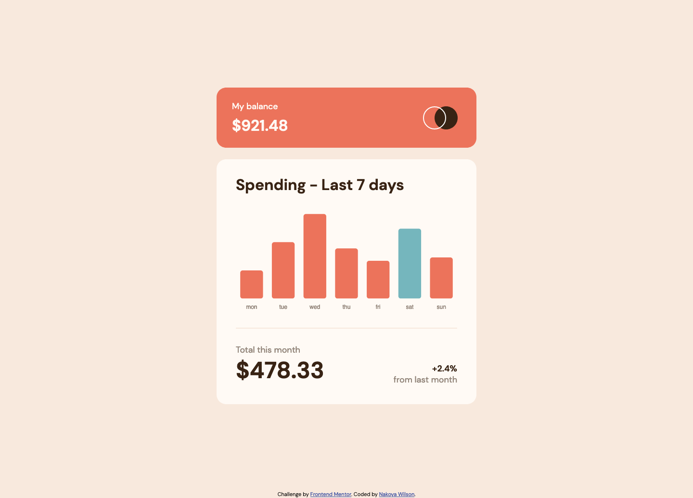

# Frontend Mentor - Expenses chart component solution

This is a solution to the [Expenses chart component challenge on Frontend Mentor](https://www.frontendmentor.io/challenges/expenses-chart-component-e7yJBUdjwt). Frontend Mentor challenges help you improve your coding skills by building realistic projects.

## Table of contents

- [Overview](#overview)
  - [The challenge](#the-challenge)
  - [Screenshot](#screenshot)
  - [Links](#links)
- [My process](#my-process)
  - [Built with](#built-with)
- [Author](#author)

## Overview

### The challenge

Users should be able to:

- [x] View the bar chart and hover over the individual bars to see the correct amounts for each day
- [x] See the current day’s bar highlighted in a different colour to the other bars
- [x] View the optimal layout for the content depending on their device’s screen size
- [x] See hover states for all interactive elements on the page
- [x] **Bonus**: Use the JSON data file provided to dynamically size the bars on the chart

### Screenshot

### Links

- Live Site URL: [https://nakoyawilson.github.io/expenses-chart-component-chartjs/](https://nakoyawilson.github.io/expenses-chart-component-chartjs/)

## My process

### Built with

- HTML
- CSS
- JavaScript
- Mobile-first workflow
- [Chart.js](https://www.chartjs.org/)

## Author

- Website - [Nakoya Wilson](https://nakoyawilson.netlify.app/)
- Frontend Mentor - [@nakoyawilson](https://www.frontendmentor.io/profile/nakoyawilson)
- Twitter - [@nakoyawilson](https://twitter.com/nakoyawilson)
- LinkedIn - [@nakoyawilson](https://www.linkedin.com/in/nakoyawilson/)
